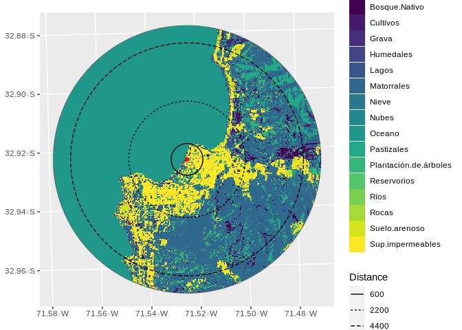

Creating buffers of Landuse
================
Derek Corcoran
2022-01-07

# 1 Methods

In this repository, the goal is to generate rasters with the proportion
of cells of different landuse within a certain distance of each point,
for the polygon showed in figure <a href="#fig:MapSite">1.1</a>:

Figure 1.1: Study site with the sampled points and the polygon
corresponding to a 5050 meter buffer of all the points

For that we used the databased generated in (Zhao et al. 2016), and used
both the raster and terra packages to create the layers (Hijmans 2021a,
2021b), using the `TerrCapasCovertura.R` script

<!-- -->

From the sampling point,

| Distance | bosque\_nativo | cultivos | grava | oceano | pastizales | matorrales | sup\_impermeables | suelo\_arenoso | plantacion\_de\_arboles |
|---------:|---------------:|---------:|------:|-------:|-----------:|-----------:|------------------:|---------------:|------------------------:|
|      600 |              0 |        1 |     1 |     51 |          3 |          8 |                31 |              1 |                       3 |
|     2200 |              0 |        1 |     1 |     59 |          3 |         10 |                21 |              1 |                       2 |
|     4400 |              0 |        1 |     1 |     59 |          3 |         10 |                21 |              1 |                       2 |

# 2 References

Hijmans, Robert J. 2021a. *Raster: Geographic Data Analysis and
Modeling*. <https://CRAN.R-project.org/package=raster>.

———. 2021b. *Terra: Spatial Data Analysis*.
<https://CRAN.R-project.org/package=terra>.

Zhao, Yuanyuan, Duole Feng, Le Yu, Xiaoyi Wang, Yanlei Chen, Yuqi Bai, H
Jaime Hernández, et al. 2016. “Detailed Dynamic Land Cover Mapping of
Chile: Accuracy Improvement by Integrating Multi-Temporal Data.” *Remote
Sensing of Environment* 183: 170–85.

